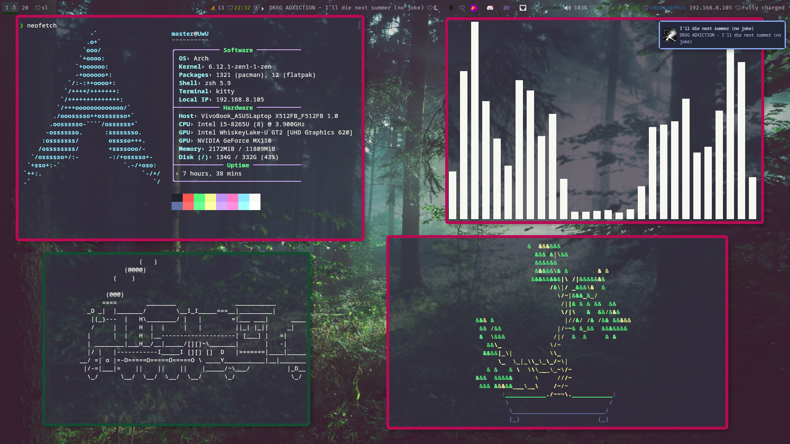
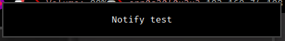
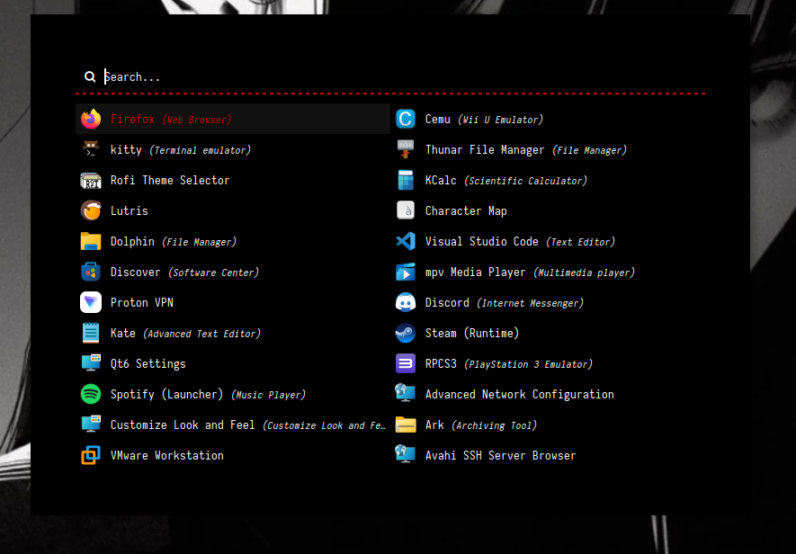
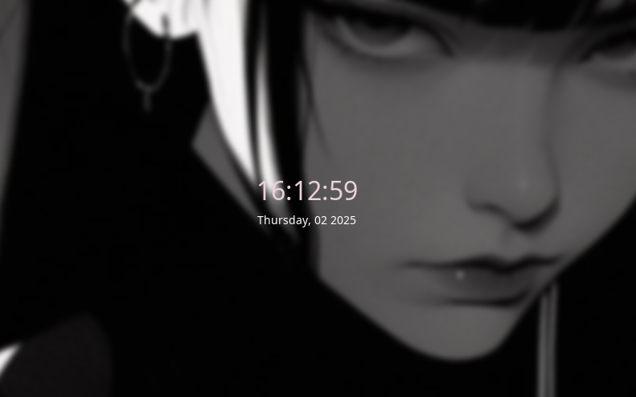
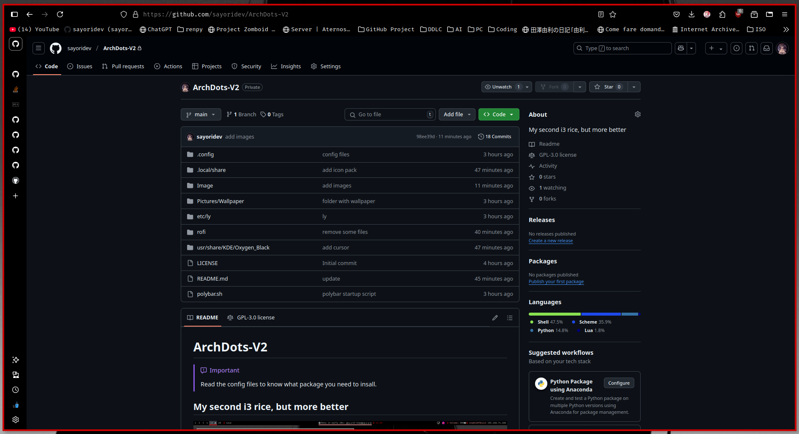
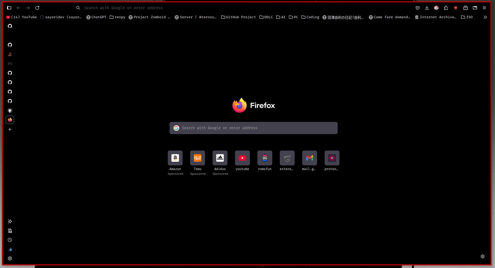
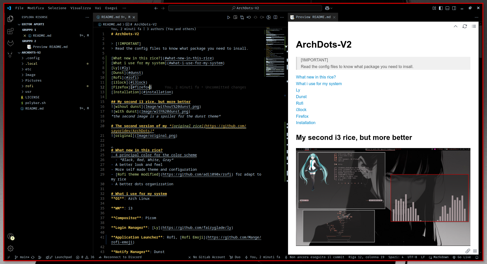

# ArchDots-V2

> [!IMPORTANT]
> Read the config files to know what package you need to insall.

[What new in this rice?](#what-new-in-this-rice)

[What i use for my system](#what-i-use-for-my-system)

[Ly](#ly)

[Dunst](#dunst)

[Rofi](#rofi)

[i3lock](#i3lock)

[Firefox](#firefox)

[Vscode](#visual-studio-code)

[Installation](#installation)

## My second i3 rice, but more better


*the second image is a spoiler for the dunst theme*

# The second version of my *[original rice](https://github.com/sayoridev/ArchDots)*



# What new in this rice?
- 4 principal color for the color scheme
  - *Black, Red, White, Gray*
- A better look and feel
- More self made theme and configuration
- [Rofi theme modified](https://github.com/adi1090x/rofi) for adapt to my rice
- A better dots organizzation

# What i use for my system
**OS**: Arch Linux

**WM**: i3

**Compositor**: Picom

**Login Manager**: [Ly](https://github.com/fairyglade/ly)

**Application Launcher**: Rofi, [Rofi Emoji](https://github.com/Mange/rofi-emoji)

**Notify Manager**: Dunst

**Terminal**: Kitty

**File Manager**: Thunar

**Icon Pack**:[Win11-red-dark](https://www.gnome-look.org/p/1546069)

**System Font**:FiraCode Nerd Font

**Text Editor**: Neovim, Visual Studio Code

**Screen Lock**: [i3lock-color](https://github.com/Raymo111/i3lock-color)

# Ly

# Dunst



# Rofi
### Dmenu

### Rofi Emoji

*This is the theme i made*

# i3lock



# Firefox


### Configuration
#### Vertical Tabs
go to ```about:config``` and enable ```sidebar.revamp``` ```sidebar.verticalTabs```
#### Theme
install [This](https://addons.mozilla.org/en-US/firefox/addon/black21/?utm_content=addons-manager-reviews-link&utm_medium=firefox-browser&utm_source=firefox-browser)

# Visual Studio Code

Install the [theme](https://marketplace.visualstudio.com/items?itemName=Jaakko.black)

# Installation
git clone the repo
```git clone https://github.com/sayoridev/ArchDots-V2```

and copy the file in the indicated directory